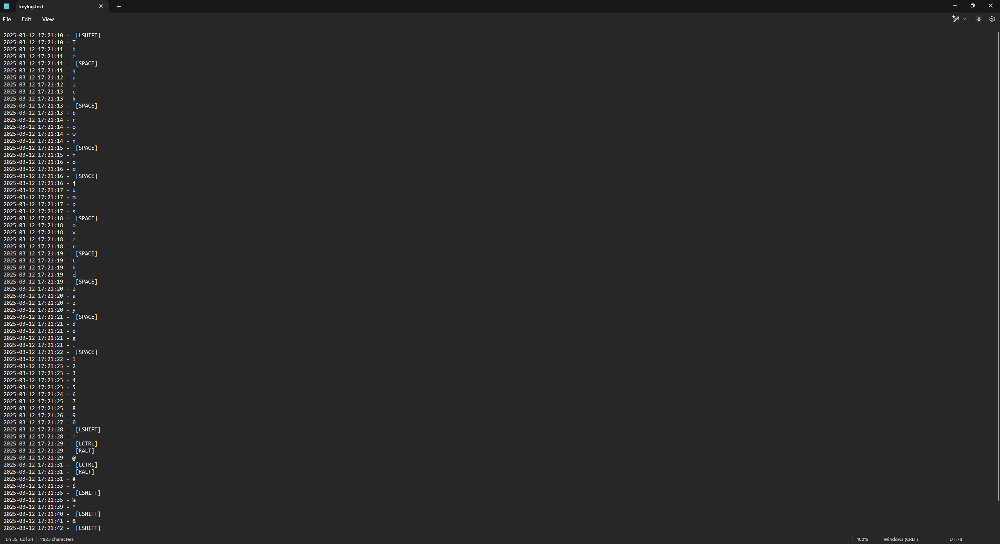

# Keylogger 🖥️🔑
**Keylogger** is a Python-based application developed to capture and record keystrokes. The project showcases how keylogging works and can be used for educational purposes, such as understanding cybersecurity threats, monitoring typing activity, or analyzing keyboard inputs for troubleshooting.

> ⚠️ **Note**: This keylogger project is created strictly for educational purposes. It is intended to help understand how keylogging works in the context of cybersecurity and system monitoring. Do not use this tool on any system without explicit permission from the owner. Unauthorized use of keyloggers is illegal and unethical. Always respect privacy and follow applicable laws.

## 🚀 Key Features
- ✍️ **Keystroke Logging**: Captures and logs all keystrokes, including regular characters and special keys.
- 🕒 **Timestamped Logging**: Records each keystroke with the exact date and time for detailed activity tracking.
- 🎯 **Special Key Handling**: Detects and logs special keys like Enter, Backspace, Space, Shift, Ctrl, Alt, Tab, Delete, and Lock keys with clear labels.
- 🛑 **Escape Key to Stop Logging**q: Stops the keylogger immediately when the Escape (Esc) key is pressed.
- 🔄 **Key Holding/Press Filtering**: Prevents duplicate logging of continuously held special keys by tracking pressed keys.
- 📁 **Log File Creation**: Automatically creates an output folder and generates a log file named [`keylog.text`](./out/keylog.text) to store recorded keystrokes.
- 💻 **Platform Detection**: Detects the operating system (Windows, macOS, or Linux) and adjusts behavior accordingly for file hiding.
- 🖥️ **Cross-Platform File Hiding**: Hides the log file on Windows using the `attrib +h` command and on macOS/Linux by renaming the file with a dot prefix.
- 🕶️ **Non-Blocking Listener**: Runs in the background using pynput's Listener without interrupting normal system operation.

## 🛠️ Tools & Technologies
[](https://skillicons.dev)
## 📂 Project Structure
## 🔧 Installation
### 📝 Things Needed:
Before you begin, make sure you have the following installed on your system:
- **Python 3.x** (You can download it from [python.org](https://www.python.org/downloads/))
- **Git** (To clone the repository)

### Steps to Install:

1. **Clone the Repository**  
   First, clone the repository using Git. Open your terminal or command prompt and run the following command:
   
   ```bash
   git clone https://github.com/your-username/keylogger.git
   ```
2. **Navigate to the Project Folder**
   Once the repository is cloned, navigate to the project directory:

   ```bash
   cd keylogger
   ```
3. **Install Dependencies**
   The project requires some Python libraries to work. You can install all the dependencies listed in the [`requirements.txt`](./requirements.txt) file using pip:
   ```bash
   pip install -r requirements.txt
   ```
   
## ▶️ Usage
1. **Start the Keylogger**  
   Navigate to the project directory (if not already there) and run the [`keylogger.py`](./keylogger.py) script:
   ```bash
   python keylogger.py
   ```
2. **Log Output**
The keylogger will create a file named [`keylog.text`](./out/keylog.text) (or a hidden file on macOS/Linux) in the [`out/`](./out) directory. This file contains all captured keystrokes, timestamped for tracking when each key was pressed.

3. **Stopping the Keylogger**
To stop the keylogger, simply press the **Escape (Esc)** key on your keyboard. This will terminate the keylogger's process.

4. **View the Log**
Open the [`keylog.text`](./out/keylog.text)(or hidden log file) to see the captured keystrokes along with their timestamps. The log will contain both regular characters and special keys like **Enter, Space, Shift, Ctrl**, and more.

## 🖼️ Screenshot
### Log File Output


## ⚠️ Disclaimer

This keylogger project is **strictly for educational purposes**. It is intended to help users understand how keyloggers work and learn about cybersecurity. 

### Important:
- **Do not use this keylogger on systems you do not have explicit permission to monitor.**
- Unauthorized use of keyloggers is illegal and can have serious legal consequences.
- Always respect the privacy of others and use this tool responsibly.

By using this project, you acknowledge and accept full responsibility for how it is used.

## 📜 License
This project is licensed under the MIT License - see the [LICENSE](./LICENSE) file for details.

## 🤝 Contributions

Contributions are always welcome! If you'd like to contribute to this project, feel free to submit a pull request or open an issue. Your help is greatly appreciated! 😊

## 📬 Contact

If you have any questions, feedback, or suggestions, feel free to reach out to me:

- **GitHub**: [@YathusanAnpalagan](https://github.com/yathusananpalagan)
- **LinkedIn**: [@YathusanAnpalagan](https://www.linkedin.com/in/yathusan-anpalagan-805957353/)

I'm happy to help and would love to hear your thoughts! 😊

## 🌟 Show Your Support

If you found this project useful or interesting, please consider giving it a **star** on GitHub! ⭐
<br>
Thank you for your support! 🙏

## 📚 Libraries Used

This project utilizes the following Python libraries:
- **pynput**: A library to monitor and control input devices (keyboard and mouse).
- **platform**: Provides a portable way to access the underlying platform's data.
- **os**: Used for interacting with the operating system, such as file management.
- **time**: Used for getting timestamps to log keystrokes with the exact time they occurr
